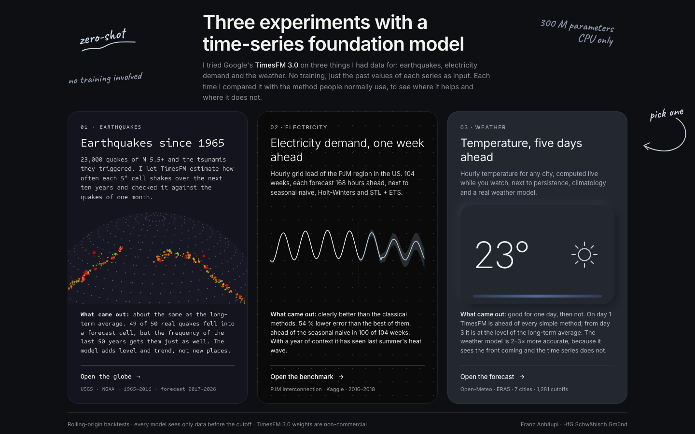
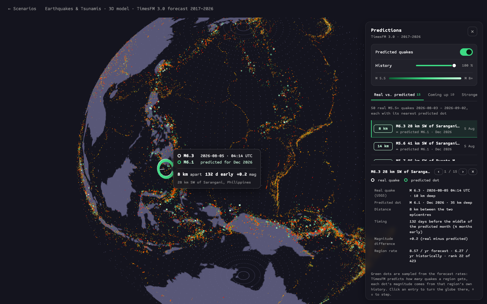
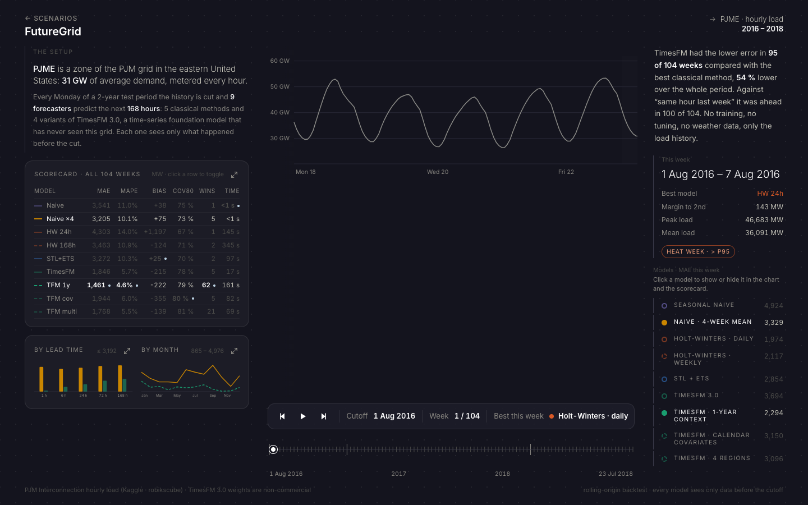
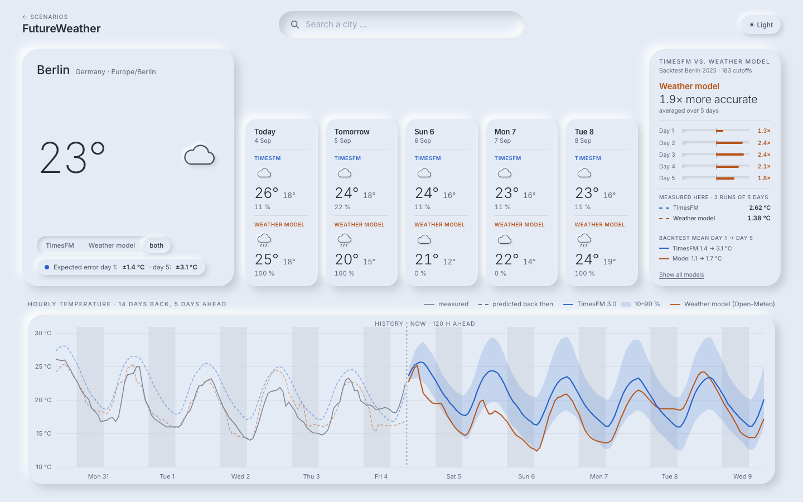

<div align="center">

# Future Lab

**Kann ein KI-Modell die Zukunft aus der Vergangenheit lesen?**
Ein Modell, drei Gegenstände, drei ehrliche Antworten.

Erdbeben · Strom · Wetter — jeweils gemessen gegen das, was dort Standard ist.

[Startseite](#die-seite) · [Wie es funktioniert](#wie-es-funktioniert) · [Ergebnisse](#die-ergebnisse) · [Was wir gelernt haben](#was-wir-gelernt-haben) · [Selbst starten](#selbst-starten) · [Daten & Lizenzen](#daten-und-lizenzen)

</div>



## Worum es geht

Google hat mit **TimesFM 3.0** ein Modell veröffentlicht, das auf Milliarden von Zeitreihen trainiert wurde,
Verkaufszahlen, Sensorwerte, Webtraffic, was auch immer. Die Idee: Man gibt ihm irgendeine Zahlenreihe aus der
Vergangenheit, und es sagt die nächsten Werte voraus. **Ohne Training, ohne Anpassung, ohne zu wissen, was die
Zahlen bedeuten.** Das nennt man *zero-shot*.

Das klingt nach Magie. Also haben wir es auf drei sehr verschiedene Dinge losgelassen und jedes Mal gefragt:
*Ist das wirklich besser als das, was man sonst tut?*

| | Szenario | Die Frage | Gegner | Ergebnis |
|---|---|---|---|---|
| 01 | **Erdbeben** | Wo bebt es als Nächstes? | Die Häufigkeit der letzten 50 Jahre | **Unentschieden** |
| 02 | **Strom** | Wie viel Last zieht das Netz morgen um 18 Uhr? | Klassische Statistik (Holt-Winters, STL) | **TimesFM gewinnt** |
| 03 | **Wetter** | Wie warm wird es in fünf Tagen? | Ein echtes Wettermodell (ICON, ECMWF) | **Wettermodell gewinnt** |

Die kurze Erklärung, warum die Antworten so verschieden ausfallen, steht am Ende. Sie ist der eigentliche
Befund des Projekts.

## Die Seite

Eine Startseite, drei Unterseiten, jede in ihrem eigenen Design. Alles läuft lokal im Browser.

| | |
|---|---|
|  |  |
| **Erdbeben** — 23 000 Beben seit 1965 auf einem Punktwolken-Globus, in Grün die Prognose bis 2026. Klick auf eine Region dreht den Globus dorthin. | **Strom** — Der Backtest als Zeitreise: Mit dem Slider springt man durch 104 Wochen und sieht, wer diese Woche am besten lag. |



**Wetter** — Die einzige Seite, die *live* rechnet. Stadt suchen, und TimesFM sagt auf der CPU in drei Sekunden die
nächsten fünf Tage voraus, daneben das Wettermodell von Open-Meteo. Gestrichelt in der Vergangenheit: was beide
vor fünf Tagen gesagt haben, über der Wahrheit. Rechts das gemessene Duell.

## Wie es funktioniert

### Das Modell

TimesFM ist ein Transformer, dieselbe Architektur wie bei Sprachmodellen, nur dass die „Wörter“ hier Stücke
einer Zahlenreihe sind. Man gibt ihm die letzten Werte (den *Kontext*, bei uns 92 Tage bis ein Jahr) und
bekommt die nächsten 168 Stunden zurück, dazu neun Quantile, also ein Unsicherheitsband. Das Ganze läuft auf
einem normalen Laptop ohne Grafikkarte: 183 Wochenvorhersagen in 53 Sekunden.

### Der Test

Man kann ein Vorhersagemodell nicht bewerten, indem man ihm die Zukunft zeigt. Deshalb der **Backtest**:

1. Wir nehmen einen Tag in der Vergangenheit, etwa den 1. März 2025, und schneiden dort die Daten ab.
2. Jedes Modell sieht nur, was davor war, und sagt die nächste Woche voraus.
3. Wir vergleichen mit dem, was dann wirklich passiert ist.
4. Zwei Tage weiter, noch mal. Und noch mal. Beim Wetter 1 281 Mal, beim Strom 104 Mal.

Dabei gelten harte Regeln: Kein Modell darf in die Zukunft schauen, auch nicht durch die Hintertür. Die
Klimatologie kennt nur die Jahre vor dem Testjahr, Parameter werden auf einem Vorjahr eingestellt, und die
Unsicherheitsbänder der klassischen Verfahren kommen aus früheren Fehlern, nicht aus dem Testjahr.

### Die Gegner

Ein Modell ist nur so gut wie der Gegner, gegen den man es misst. Deshalb sind die Gegner absichtlich stark:

- **Persistenz**: „Morgen wie heute.“ Beim Wetter erstaunlich schwer zu schlagen.
- **Klimatologie**: Das langjährige Mittel für diesen Tag und diese Stunde.
- **Blend**: Persistenz, die langsam in die Klimatologie übergeht. Die beste Trivialmethode.
- **Holt-Winters, STL + ETS**: Die klassische Statistik für saisonale Reihen (Strom).
- **Wettermodelle**: Open-Meteo liefert für jeden Ort das beste regionale Modell (ICON in Europa, GFS in den
  USA, JMA in Japan), dazu ECMWF als weltweit einheitlichen Vergleich. Beide aus dem Archiv, so wie sie am
  jeweiligen Tag tatsächlich veröffentlicht wurden.

## Die Ergebnisse

### 02 · Strom: TimesFM gewinnt deutlich

Stündliche Netzlast der PJM-Region (USA), 104 Wochen, 168 Stunden voraus. Fehler in Megawatt.

| Modell | MAE | vs. beste Klassik | Beste Wochen |
|---|---:|---:|---:|
| Saisonale Naive (gleiche Stunde letzte Woche) | 3 541 | | 1 |
| Naive, Mittel der letzten 4 Wochen | 3 205 | | 5 |
| Holt-Winters, Wochensaison | 3 463 | | 2 |
| STL + ETS | 3 272 | | 2 |
| TimesFM 3.0, 8 Wochen Kontext | 1 846 | −42 % | 5 |
| **TimesFM 3.0, 1 Jahr Kontext** | **1 461** | **−54 %** | **62** |
| TimesFM 3.0, 4 Regionen gemeinsam | 1 768 | −45 % | 21 |

TimesFM schlägt die saisonale Naive in **100 von 104 Wochen**. An Vorlauf 1 h liegt es bei 143 MW, die
Klassiker bei rund 3 000 MW, weil sie an der letzten Woche kleben. In Hitzewochen verdoppeln die Klassiker
ihren Fehler, TimesFM mit einem Jahr Kontext nicht: Es hat den Sommer davor gesehen.

### 03 · Wetter: das Wettermodell gewinnt, aber TimesFM hat einen guten Tag

Stündliche Temperatur, sieben Städte in sieben Klimazonen, 1 281 Vorhersagen im Jahr 2025. Fehler in °C je Vorlauftag.

| Modell | Tag 1 | Tag 2 | Tag 3 | Tag 5 | Tag 7 |
|---|---:|---:|---:|---:|---:|
| Persistenz | 2,01 | 2,67 | 2,99 | 3,27 | 3,38 |
| Klimatologie | 2,64 | 2,63 | 2,65 | 2,66 | 2,67 |
| Blend | 1,92 | 2,34 | 2,50 | 2,61 | 2,65 |
| TimesFM 3.0 (Berlin) | **1,41** | 2,43 | 2,96 | 3,15 | 3,36 |
| Wettermodell Open-Meteo | 1,34 | 1,63 | 1,72 | 2,04 | 2,48 |
| **Wettermodell ECMWF** | **0,83** | **0,99** | **1,13** | **1,52** | **2,05** |

An Tag 1 ist TimesFM besser als jedes Trivialverfahren. Ab Tag 3 ist es auf dem Niveau der Klimatologie, ab
Tag 2 hinter dem simplen Blend. ECMWF ist an Tag 7 noch genauer als TimesFM an Tag 2. Bemerkenswert:
Die **Unsicherheitsbänder** von TimesFM stimmen (78–82 % Abdeckung, der Fächer wächst von 5 auf 10 °C). Das
Modell weiß, was es nicht weiß. Es weiß nur nichts über die Front, die übermorgen kommt.

TimesFM ist beim Wetter bisher für Berlin (alle Varianten) und Reykjavík gerechnet; die anderen fünf Städte
folgen (Befehle unten). Die vollständigen Tabellen mit allen Varianten, Symbol-Trefferquoten und Bändern
stehen in [docs/README-wetter-details.md](docs/README-wetter-details.md).

### 01 · Erdbeben: unentschieden, mit einem Twist

23 000 Beben ab Magnitude 5,5 (USGS, 1965–2016). TimesFM sagt für jede 5°-Zelle voraus, wie *oft* es dort
bebt, zehn Jahre voraus. Bewertet gegen die echten Beben eines Monats (August 2026, 50 Beben):

| Maß | TimesFM | Klimatologie 1965–2016 |
|---|---:|---:|
| Erwartete Anzahl (beobachtet: 50) | 57,5 | 36–42 |
| Reale Beben in einer Prognosezelle | 49 / 50 | 49 / 50 |
| Log-Likelihood der Zellzahlen (höher = besser) | −170,9 | −155,3 |

„49 von 50“ klingt spektakulär und ist es nicht, weil die Häufigkeit der letzten 50 Jahre dasselbe schafft:
Beben passieren dort, wo sie immer passieren. Das Modell trifft das **Niveau** besser als die Klimatologie,
die räumliche Verteilung nicht. Ein Monat ist außerdem viel zu kurz für eine Zehnjahresprognose.

## Was wir gelernt haben

**Die eine Regel.** TimesFM gewinnt genau so lange, wie die Zukunft in der eigenen Vergangenheit der Reihe
steckt. Stromlast ist Kalender plus Gewohnheit, also gewinnt es die ganze Woche. Temperatur hat etwa einen Tag
Gedächtnis, danach entscheidet eine Front, die tausend Kilometer entfernt entstanden ist, also gewinnt es einen
Tag. Erdbeben sind räumlich stabil und zeitlich fast zufällig, also bleibt nur die Häufigkeit. Das ist keine
Schwäche des Modells, sondern eine Eigenschaft des Gegenstands.

**Die Bänder stimmen.** Ohne jede Kalibrierung deckt das 10–90-%-Band in allen Szenarien rund 80 % der
Wahrheit ab. Ehrliche Unsicherheit *out of the box* ist im Alltag oft wertvoller als ein paar Zehntel weniger Fehler.

**Kontext ja, Erklärungen nein.** Ein Jahr Kontext hilft in beiden Backtests. Kalender-Kovariaten (Stunde,
Wochentag als Zusatzinput) haben in beiden leicht geschadet und das Zehnfache an Rechenzeit gekostet.

**Es vergisst nicht.** TimesFM schreibt die letzten Tage fort, statt zur Klimatologie zurückzukehren. In
Phoenix hält es an der Hitze der Vorwoche fest, obwohl sie vorbei ist. Ein Blend aus TimesFM und Klimatologie
ab Tag 2 würde vermutlich jedes Trivialverfahren an jedem Tag schlagen.

**Der Gegner muss stark sein.** Open-Meteos `best_match` ist in Phoenix (GFS) an Tag 3 schlechter als unser
Blend. Ohne die ECMWF-Spalte hätten wir einen falschen Schluss gezogen.

**Die Fehler steckten in den Daten.** Open-Meteo liefert 58 der versprochenen 92 Tage; ein `interpolate()` hat
daraus 34 Tage flache Linie gemacht und sie dem Modell als Kontext gegeben. Ungleich lange Kontexte in einem
Batch kommen still als NaN zurück. Beide Fehler hätten das Ergebnis unbemerkt verfälscht. Die Messinfrastruktur
war mehr Arbeit als die Modelle, und das zu Recht.

## Selbst starten

Voraussetzungen: Node 22, Python 3.12, [uv](https://docs.astral.sh/uv/). Die TimesFM-Gewichte (1,2 GB) lädt der
erste Lauf automatisch von Hugging Face.

```bash
git clone https://github.com/Litorian113/FutureWeather.git && cd FutureWeather
npm install
uv venv --python 3.12 .venv && uv pip install --python .venv/bin/python -r requirements.txt

npm run dev                          # http://localhost:5503  (Startseite, alle drei Szenarien)
.venv/bin/python weather/server.py   # Port 8000, nur das Wetter braucht ihn (rechnet live)
```

Die Backtest-Ergebnisse liegen als JSON im Repo, die Seiten funktionieren also sofort. Wer die Zahlen
nachrechnen will:

```bash
.venv/bin/python weather/prepare_weather.py     # ERA5-Historie für sieben Städte (gecacht)
.venv/bin/python weather/nwp.py                 # archivierte Wettermodell-Läufe 2025
.venv/bin/python weather/backtest.py --models persistence naive_week climatology blend nwp nwp_ecmwf
.venv/bin/python weather/backtest.py --models timesfm timesfm_multi timesfm_cov timesfm_long   # ≈ 25 min je Stadt
.venv/bin/python weather/backtest.py            # JSON zusammensetzen
.venv/bin/python weather/report.py              # Markdown-Tabellen
```

Für Strom und Erdbeben liegen die Rechen-Pipelines in den Ursprungsprojekten (FutureGrid,
Erdbeben-Visualisierung); hier sind ihre Seiten und fertigen Ergebnisse eingebaut.

Intel-Mac: torch 2.2.2 ist das letzte Release, deshalb `numpy<2` und der RMSNorm-Shim in
`weather/torch_compat.py`. Auf Apple Silicon und Linux läuft ein aktuelles torch direkt.

## Aufbau

```
index.html · wetter.html · strom.html · erdbeben.html   vier Vite-Einstiege, jede Seite mit eigenem Bundle
src/hub/          Startseite
src/wetter/       Wetter: React-App, live gegen den FastAPI-Server
src/strom/        FutureGrid, unverändert übernommen
src/erdbeben/     Erdbeben-Visualisierung (three.js), hier nur der Globus
weather/          Python: Open-Meteo-Client, Backtest, Modelle, Server
public/data/      Backtest-Ergebnisse (JSON), Erdbeben- und Tsunami-Daten
docs/             Screenshots und die ausführliche Wetter-Dokumentation
```

Technik: React 18, TypeScript, Vite (Multi-Page), three.js für den Globus, alle Diagramme als handgeschriebenes
SVG. Python 3.12 mit TimesFM 3.0 (PyTorch), pandas, FastAPI. Screenshots per Headless Chrome (`scripts/shot.mjs`).

## Daten und Lizenzen

Der Code in diesem Repository steht unter der [MIT-Lizenz](LICENSE).

| Was | Quelle | Lizenz |
|---|---|---|
| TimesFM 3.0 (Code) | [google-research/timesfm](https://github.com/google-research/timesfm) | Apache 2.0 |
| TimesFM 3.0 (Gewichte) | [Hugging Face](https://huggingface.co/google/timesfm-3.0-pytorch) | **nicht kommerziell**; werden nicht mitgeliefert, sondern beim ersten Lauf geladen |
| Wetterdaten, Wettermodell-Archiv, Geocoding | [Open-Meteo](https://open-meteo.com) | CC BY 4.0 |
| ERA5-Reanalyse (über Open-Meteo) | Copernicus / ECMWF | frei mit Quellenangabe |
| Stromlast PJM | Kaggle, [robikscube/hourly-energy-consumption](https://www.kaggle.com/datasets/robikscube/hourly-energy-consumption) | CC0 |
| Erdbeben | USGS | Public Domain |
| Tsunamis | NOAA NCEI | Public Domain |
| Schriften | Inter, Sometype Mono via Google Fonts | SIL Open Font License |
| Bibliotheken | React, three.js, Vite, PyTorch, pandas, FastAPI u. a. | MIT / BSD |

Die Weltkarte des Globus ist
[„Equirectangular projection world map without borders“](https://commons.wikimedia.org/wiki/File:Equirectangular_projection_world_map_without_borders.svg)
von Ebrahim, Wikimedia Commons, [CC BY-SA 4.0](https://creativecommons.org/licenses/by-sa/4.0/), unverändert
verwendet. Die übrigen Grafiken sind eigene Arbeiten. Die mitgelieferten JSON-Dateien sind aus den genannten
Quellen abgeleitete Ergebnisse, keine Rohdaten.

## Über das Projekt

Entstanden 2026 an der HfG Schwäbisch Gmünd als Frage an ein neues Werkzeug: Wie weit kommt ein
Foundation-Modell für Zeitreihen, wenn man es ehrlich misst? Die Antwort in einem Satz:

> *Ein Foundation-Modell für Zeitreihen ist ein sehr guter Statistiker, der nichts von der Welt weiß.
> Wo die Reihe die Welt enthält, gewinnt er. Wo die Welt außerhalb der Reihe passiert, muss man sie ihm bringen.*

Franz Anhäupl · Umsetzung mit Claude Code
