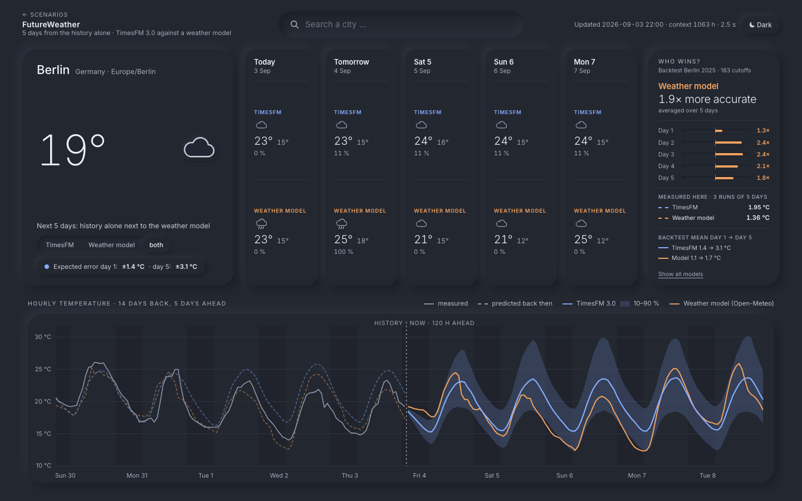
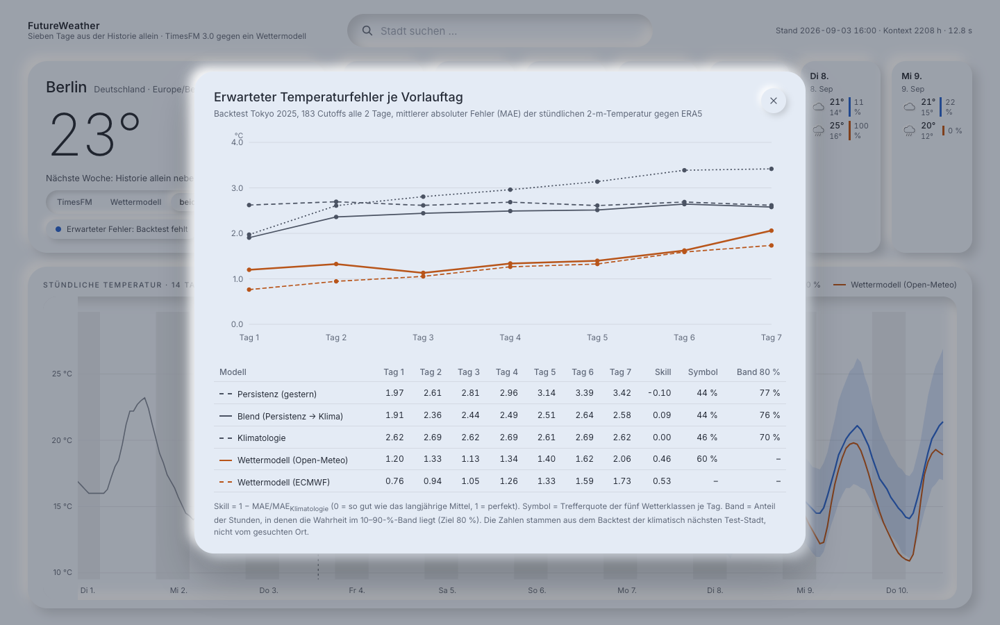

<div align="center">

# Future Lab · FutureWeather

**Sieben Tage Wetter aus der Historie allein.**
TimesFM 3.0 zero-shot gegen Persistenz, Klimatologie und ein echtes Wettermodell,
gemessen über ein Jahr, sieben Klimazonen und 1 281 Vorhersagen.

React · TypeScript · Vite · Python · FastAPI · Open-Meteo · TimesFM 3.0

</div>

> **Dieses Repository ist seit dem 3. September 2026 die Startseite für drei Szenarien.** `index.html` ist
> eine Übersicht, von der aus man in **Erdbeben** (Globus, three.js), **Strom** (FutureGrid) und **Wetter**
> (dieses Projekt) springt. Jedes Szenario ist eine eigene Vite-Seite mit eigenem Bundle und eigenem
> Stylesheet — die drei Designs teilen sich keine Seite. Siehe [Drei Szenarien](#drei-szenarien).


<p align="center"><sub>Modus „beide“: TimesFM (blau, mit 10–90-%-Band) neben dem Wettermodell von Open-Meteo (orange). In der Historie liegen gestrichelt die Vorhersagen, die beide vor fünf Tagen abgegeben haben, über der gemessenen Wahrheit; rechts das gemessene Duell.</sub></p>

---

## Das Ergebnis in drei Sätzen

1. **Tag 1 gewinnt die Historie deutlich gegen alle Trivialverfahren:** TimesFM trifft die stündliche Temperatur
   am ersten Tag mit 1,4 °C Fehler (Berlin), Persistenz braucht 2,2 °C, Klimatologie 2,9 °C.
2. **Ab Tag 3 ist die Information aus der Zeitreihe verbraucht:** TimesFM fällt auf das Niveau der Klimatologie
   zurück (Skill ≈ 0 oder leicht negativ) und liegt hinter dem simplen Blend aus Persistenz und Klimatologie.
3. **Das Wettermodell spielt in einer anderen Liga:** ECMWF hat an Tag 1 einen Fehler von 0,6–0,8 °C und an Tag 7
   immer noch weniger als TimesFM an Tag 2. Ab Tag 3 ist es um den Faktor 2–3 besser. Genau das steht auch auf
   der Seite, als „Ehrlichkeits-Chip“ neben der Vorhersage.

Die Bänder von TimesFM sind dagegen erstaunlich gut kalibriert: 78–82 % Abdeckung an jedem Vorlauftag, und der
Fächer wächst von 5 °C an Tag 1 auf 10 °C an Tag 7. Das Modell weiß also, was es nicht weiß, es weiß nur nichts
über die kommende Front.

> Die TimesFM-Zahlen stammen bisher aus **Berlin (alle vier Varianten) und Reykjavík (drei Varianten)**; der
> Lauf über die fünf übrigen Städte ist vorbereitet (siehe [Reproduktion](#reproduktion)) und dauert etwa
> zwei Stunden CPU. Baselines und Wettermodell sind für alle sieben Städte vollständig.

## Inhalt

- [Drei Szenarien](#drei-szenarien)
- [Worum es geht](#worum-es-geht)
- [Die Seite](#die-seite)
- [Daten](#daten)
- [Protokoll](#protokoll)
- [Ergebnisse](#ergebnisse)
- [Interpretation](#interpretation)
- [Reproduktion](#reproduktion)
- [Einschränkungen](#einschränkungen)
- [Struktur](#struktur)

## Drei Szenarien

Dieselbe Frage — *kann TimesFM 3.0 zero-shot aus der Historie allein vorhersagen?* — an drei Gegenständen,
jeweils gegen die dort üblichen Verfahren gemessen. Drei verschiedene Antworten:

| Seite | Szenario | Quelle | Antwort |
|---|---|---|---|
| `erdbeben.html` | **Erdbeben** — 23 000 Beben M ≥ 5,5 seit 1965 (USGS), Tsunamis (NOAA), Raten je 5°-Zelle zehn Jahre voraus | `Datenvisualisierung/Visualisierung` (React + three.js) | **Unentschieden.** 49 von 50 realen Beben in einer Prognosezelle, aber die Klimatologie der Zelle trifft genauso |
| `strom.html` | **Strom** — stündliche PJM-Netzlast, 104 Wochen Backtest, 168 h voraus | `FutureGrid` | **TimesFM gewinnt.** 54 % weniger Fehler als das beste klassische Modell |
| `wetter.html` | **Wetter** — stündliche Temperatur jeder Stadt, live, 120 h voraus | dieses Projekt | **Wettermodell gewinnt.** TimesFM stark an Tag 1, ab Tag 3 Klimatologie |

Technisch ist das eine Vite-**Multi-Page-App**: `vite.config.ts` listet vier HTML-Einstiege, jeder lädt
`src/<szenario>/main.tsx`. Die Quellen der beiden importierten Projekte liegen unverändert unter
`src/strom/` und `src/erdbeben/` (nur ein „← Scenarios“-Link kam hinzu), ihre Daten unter
`public/data/energy/` bzw. `public/data/*.json` + `public/Assets/`. Von der Erdbeben-App wird im Hub nur
der **3D-Globus** gezeigt; die übrigen Seiten des Originals (Overview, Time Beam, Comparison, Depth) liegen
weiter unter `src/erdbeben/pages/`, sind aber nicht verlinkt. **Alle Seiten sind auf Englisch** — die
Startseite und die Wetterseite wurden übersetzt, FutureGrid und die Erdbeben-App waren es bereits.

| | |
|---|---|
|  |  |
| Erdbeben: Punktwolken-Globus mit den grünen TimesFM-Prognosen | Strom: FutureGrid-Benchmark mit Wochen-Slider |

## Worum es geht

Wetter ist ein chaotisches physikalisches System. Die Güte, die man von einer Wetter-App kennt, kommt aus
numerischen Modellen (ECMWF, ICON, GFS), die den Zustand der ganzen Atmosphäre assimilieren. Eine Zeitreihe
*einer* Stadt enthält davon nur den Schatten: Tagesgang, Jahresgang und die Trägheit der letzten Tage.

Das Projekt ist deshalb keine Wetter-App, die den Wetterdienst schlägt. Es ist dasselbe Experiment wie
[FutureGrid](../FutureGrid) (Stromlast), auf einem Gegenstand, bei dem der Klassiker sehr stark ist:
*Wie weit kommt ein Foundation-Modell aus der Historie allein, und wo genau bricht es ab?*

Sechs Fragen, alle quantitativ beantwortet:

| # | Frage | Antwort in Kürze |
|---|---|---|
| 1 | Wie gut sind Persistenz und Klimatologie? | Persistenz 2,0 °C an Tag 1, dann schlechter als Klimatologie (2,65 °C flach) |
| 2 | Wie gut ist der Blend aus beiden? | 1,9 → 2,65 °C, die beste Trivialmethode an jedem Tag |
| 3 | Wie gut ist TimesFM zero-shot, hilft mehr Kontext, helfen weitere Variablen? | 1,4 °C an Tag 1; ein Jahr Kontext und sechs Variablen helfen ein wenig, Kalender-Kovariaten nicht |
| 4 | Wie weit ist das Wettermodell voraus? | ECMWF 0,8 → 2,05 °C, Skill +0,69 an Tag 1 und noch +0,23 an Tag 7 |
| 5 | Taugt das Wettersymbol aus den Quantilen? | Nein: 34 % Treffer in Berlin, Klimatologie 36 %, Wettermodell 58 % |
| 6 | Sind die Bänder kalibriert? | Ja, 78–82 % Abdeckung, Fächer wächst mit dem Vorlauf |

## Die Seite

Eine Vollbild-Ansicht (1440 × 900, ohne Scrollen), weiches monochromes Neumorphismus-Design, hell und dunkel.

| | |
|---|---|
|  |  |
| Dunkelmodus (Schalter oben rechts oder `prefers-color-scheme`) | Ehrlichkeits-Popup: MAE je Vorlauftag aus dem Backtest der klimatisch nächsten Test-Stadt |

- **Stadtsuche** als versenkte Pille mit Geocoding-Vorschlägen (Debounce 250 ms, Pfeiltasten, Enter);
  letzte Stadt im `localStorage`.
- **Hero**: aktuelle Temperatur, Symbol, ein Satz und der Schalter **TimesFM · Wettermodell · beide**.
- **Fünf Tageskarten**: Wochentag, Symbol, Max/Min, Regen-%; bei „beide“ zwei beschriftete Blöcke je Karte;
  Klick markiert den Tag in der Kurve, die gewählte Karte ist versenkt.
- **Duell-Widget rechts**: der gemessene Vergleich der beiden Verfahren. Oben der Sieger und um welchen
  Faktor er genauer ist (geometrisches Mittel über die gezeigten Tage), darunter je Vorlauftag ein Balken,
  der nach links (TimesFM vorn) oder rechts (Wettermodell vorn) ausschlägt, plus die MAE-Spanne beider.
  Alles aus dem Backtest der klimatisch nächsten Test-Stadt, nicht aus der laufenden Vorhersage — die
  Wahrheit von übermorgen ist ja noch nicht bekannt. Darunter steht **„hier gemessen“**: der Fehler, den
  beide Verfahren in den drei zurückliegenden Durchläufen an genau diesem Ort wirklich gemacht haben.
  Dieser Teil existiert für jeden Ort, auch für die Städte, deren TimesFM-Backtest noch aussteht —
  für Phoenix etwa TimesFM 3,27 °C gegen Wettermodell 2,11 °C.
- **Stundenkurve**: 14 Tage Historie, Cutoff-Linie „jetzt“, 120 h mit TimesFM-Band und Wettermodell-Linie;
  Hover mit Zeit, beiden Werten und Differenz; handgebautes SVG, horizontal scrollbar bei fixer Y-Achse.
- **Rückblick über der Historie**: dieselbe Vorhersage, aber **dreimal in der Vergangenheit gestartet**
  (vor 15, 10 und 5 Tagen, je 120 h) und aneinandergehängt, sodass die gestrichelten Modelllinien die
  komplette 14-Tage-Historie abdecken. Halbtransparent über der gemessenen Kurve sieht man sofort, wo
  jedes Modell danebenlag; der Hover zeigt Messwert, beide Vorhersagen von damals und ihre Abweichung.
  Die drei TimesFM-Läufe entstehen im selben Batch wie die Live-Vorhersage (Gesamtlaufzeit ≈ 4 s), die
  Wettermodell-Linien kommen aus dem `previous-runs`-Archiv.
- **Ehrlichkeits-Chip**: „Erwarteter Fehler Tag 1 / Tag 5“ aus dem Backtest; Klick öffnet die MAE-Kurve
  je Vorlauftag für Persistenz, Blend, Klimatologie, TimesFM und Wettermodell.
- Eigener SVG-Symbolsatz (Sonne, Wolke, Regen, Schnee, Nebel), Linien Blau / Orange / Grau mit Strichmuster
  als zweiter Kodierung, sichtbarer Fokusring, Text ≥ 4,5:1.

Die Seite zeigt **fünf Tage** voraus (Konstante `DAYS_SHOWN` in `src/App.tsx`); Server und Backtest
rechnen unverändert die vollen 168 h, damit die Tabellen bis Tag 7 reichen.

Die Seite rechnet **live für jede Stadt**: der FastAPI-Server holt die letzten 92 Tage vom
Open-Meteo-Echtzeit-Endpunkt, lässt TimesFM 3.0 als 6-variaten Kontext auf der CPU laufen (≈ 3 s) und stellt
daneben die 7-Tage-Vorhersage des Wettermodells, das Open-Meteo für den Ort ausliefert. Der Cutoff ist die
nächste volle Stunde; die Tageskarten sind Kalendertage (heute = gemessene Stunden plus Rest-Vorhersage).
Ohne laufenden Server zeigt die Seite den Startbefehl statt eines Fehlers.

## Daten

Alles von [Open-Meteo](https://open-meteo.com) (frei, kein Schlüssel, Ortszeit), alle Antworten auf Platte gecacht.

| Zweck | Endpunkt | Anmerkung |
|---|---|---|
| Wahrheit und Historie | `archive-api` (ERA5-Reanalyse) | stündlich seit 2014, Gitterwert 9–25 km, ~5 Tage Verzug |
| Archivierte Modellläufe | `previous-runs-api` | `<var>_previous_dayN` = Wert, den der Lauf N Tage vorher für diese Stunde vorhergesagt hat |
| Live-Kontext und Live-Wettermodell | `api.open-meteo.com/v1/forecast` | `past_days=92`, `forecast_days=8` |
| Stadtsuche | `geocoding-api` | |

Variablen: Temperatur 2 m, relative Feuchte, Niederschlag, Bewölkung, Wind 10 m, Bodendruck, WMO-`weather_code`.

**Abdeckung der archivierten Läufe** (geprüft am 2026-09-03): `best_match` und `gfs_seamless` liefern alle
sieben Vorlauftage seit 2022-01, ECMWF IFS 0,25° erst ab 2024-02, ICON nur Vorlauf 1–4; `weather_code` ist
für ECMWF nicht archiviert. Deshalb ist das **Testjahr 2025**: dort ist das Archiv für beide Wettermodelle
lückenlos, und ERA5 reicht bis August 2026. Zusätzlich sichert ein launchd-Agent
(`weather/archive_forecasts.py`, täglich 06:00) die Live-Vorhersage der sieben Städte als Reserve.

### Test-Städte

| Stadt | Warum | Tages- / Jahresamplitude | Blend-τ |
|---|---|---|---|
| Berlin | gemäßigt, Fronten, Referenz | 7,7 K / 25,3 K | 72 h |
| Reykjavík | maritim, kleine Amplitude, viel Wind | 4,5 K / 16,7 K | 72 h |
| Phoenix | Wüste, extrem vorhersagbar | 13,6 K / 28,3 K | 144 h |
| Singapur | Tropen, fast kein Jahresgang, täglich Regen | 4,0 K / 3,8 K | 96 h |
| Kapstadt | Südhalbkugel, Jahreszeiten gespiegelt | 7,6 K / 12,2 K | 18 h |
| Denver | kontinental, sprunghaft (−36,5 … 39,8 °C) | 15,2 K / 33,2 K | 48 h |
| Tokio | Monsun, Taifunsaison | 8,2 K / 27,2 K | 96 h |

Amplituden aus ERA5 2014–2026; τ ist die Abklingzeit des Blends, je Stadt auf 2024 gefittet.

## Protokoll

- **Rolling-Origin-Backtest**: Cutoffs alle 2 Tage um 00:00 Ortszeit über 2025 → 183 je Stadt,
  **1 281 Vorhersagen**, Horizont 168 h. Der Cutoff ist die erste Vorhersagestunde; jedes Modell sieht nur
  Stunden davor.
- **Kein Leakage**: Klimatologie nur aus 2014–2024, Blend-τ auf 2024 gefittet, Bänder nur aus vergangenen
  Out-of-sample-Fehlern, TimesFM ohne Kalibrierung.
- **Metriken** je Modell, Stadt und Vorlauftag 1…7: MAE, RMSE, Bias, Abdeckung und Breite des 10–90-%-Bands,
  Pinball-Loss, **Skill = 1 − MAE/MAE<sub>Klimatologie</sub>** auf denselben Stunden (0 = so gut wie das
  langjährige Mittel, 1 = perfekt, < 0 = schlechter).
- **Wettersymbol**: fünf Klassen (klar, bewölkt, Regen, Schnee, Nebel) je Tag. Wahrheit aus dem stündlichen
  ERA5-`weather_code` (Schnee ≥ 3 h, sonst Regen ≥ 3 h, sonst Nebel ≥ 3 h, sonst bewölkt, wenn die Hälfte der
  Stunden nicht klar ist). Modelle nach dem Regelsatz: Regen bei p<sub>Regen</sub> > 0,5 (Schnee bei Tagesmittel
  < 1 °C), Nebel bei Feuchte > 95 % und Wind < 2 m/s, bewölkt bei Bewölkung > 60 %, sonst klar. Das Wettermodell
  nutzt seinen eigenen `weather_code`, Persistenz das Symbol von gestern.
- **Regenwahrscheinlichkeit** von TimesFM: Anteil der neun Niederschlags-Quantilpfade (p = 0,1 … 0,9), deren
  Tagessumme ≥ 1 mm ist; bewertet mit dem Brier-Score gegen die klimatologische Häufigkeit.
- CPU-Zeiten: Intel-MacBook, torch 2.2.2, kein GPU.

### Modelle

| Name | Was es ist |
|---|---|
| `persistence` | gleiche Stunde gestern, für alle 168 h wiederholt; Band aus den Lag-24·d-Fehlern der letzten 8 Wochen |
| `naive_week` | gleiche Stunde letzte Woche |
| `climatology` | Mittel derselben Stunde am selben Tag des Jahres ± 7 Tage über 2014–2024; Band aus deren Streuung |
| `blend` | `clim(t) + (Anomalie von gestern je Tagesstunde) · exp(−h/τ)`; Band aus 28 früheren Origins |
| `nwp` | Open-Meteo `best_match` (regional bestes Modell), archivierter Lauf vom Vortag je Vorlauftag; deterministisch |
| `nwp_ecmwf` | dasselbe aus ECMWF IFS 0,25°, nur Temperatur |
| `timesfm` | TimesFM 3.0 zero-shot, nur Temperatur, Kontext 2 208 h (92 Tage, so viel hat der Live-Server) |
| `timesfm_long` | Kontext 8 760 h (ein Jahr, sieht den Jahresgang) |
| `timesfm_cov` | 2 208 h + Stunde-des-Tages und Tag-des-Jahres als sin/cos-Kovariaten |
| `timesfm_multi` | Temperatur + Feuchte + Niederschlag + Bewölkung + Wind + Druck als 6-variater Kontext; die einzige Variante mit Wettersymbol |

## Ergebnisse

Alle Tabellen kommen aus `weather/report.py`; Zahlen in °C, Testjahr 2025.

### Alle sieben Städte: Baselines gegen Wettermodell (1 281 Cutoffs)

| Modell | MAE | RMSE | Bias | Skill | Abdeckung 10–90 % | Bandbreite | Beste Cutoffs |
|---|---:|---:|---:|---:|---:|---:|---:|
| Persistenz (gleiche Stunde gestern) | 2,97 | 4,17 | −0,02 | −0,12 | 78 % | 9,4 | 47 |
| Gleiche Stunde letzte Woche | 3,36 | 4,67 | −0,03 | −0,27 | 78 % | 10,5 | 19 |
| Klimatologie (±7 d, 2014–2024) | 2,65 | 3,60 | −0,80 | 0,00 | 73 % | 7,6 | 60 |
| Blend (Persistenz → Klimatologie) | 2,45 | 3,38 | −0,51 | +0,07 | 75 % | 7,3 | 105 |
| Wettermodell Open-Meteo best_match | 1,90 | 2,71 | +0,72 | +0,28 | – | – | 273 |
| Wettermodell ECMWF IFS 0,25° | **1,38** | **2,00** | −0,20 | **+0,48** | – | – | **777** |

MAE je Vorlauftag:

| Modell | Tag 1 | Tag 2 | Tag 3 | Tag 4 | Tag 5 | Tag 6 | Tag 7 |
|---|---:|---:|---:|---:|---:|---:|---:|
| Persistenz | 2,01 | 2,67 | 2,99 | 3,13 | 3,27 | 3,33 | 3,38 |
| Klimatologie | 2,64 | 2,63 | 2,65 | 2,64 | 2,66 | 2,64 | 2,67 |
| Blend | 1,92 | 2,34 | 2,50 | 2,53 | 2,61 | 2,62 | 2,65 |
| Wettermodell best_match | 1,34 | 1,63 | 1,72 | 1,86 | 2,04 | 2,24 | 2,48 |
| Wettermodell ECMWF | **0,83** | **0,99** | **1,13** | **1,30** | **1,52** | **1,85** | **2,05** |

Skill gegen Klimatologie je Vorlauftag:

| Modell | Tag 1 | Tag 2 | Tag 3 | Tag 4 | Tag 5 | Tag 6 | Tag 7 |
|---|---:|---:|---:|---:|---:|---:|---:|
| Persistenz | +0,24 | −0,02 | −0,13 | −0,19 | −0,23 | −0,26 | −0,27 |
| Blend | +0,27 | +0,11 | +0,05 | +0,04 | +0,02 | +0,01 | +0,01 |
| Wettermodell best_match | +0,49 | +0,38 | +0,35 | +0,29 | +0,23 | +0,15 | +0,07 |
| Wettermodell ECMWF | +0,69 | +0,62 | +0,57 | +0,51 | +0,43 | +0,30 | +0,23 |

MAE je Stadt, alle Vorlauftage (Tag 1 / Tag 3 / Tag 7):

| Modell | Berlin | Reykjavík | Phoenix | Singapur | Kapstadt | Denver | Tokio |
|---|---:|---:|---:|---:|---:|---:|---:|
| Persistenz | 2,2 / 3,4 / 4,0 | 1,9 / 2,9 / 3,5 | 1,8 / 3,2 / 3,7 | 1,0 / 1,2 / 1,3 | 1,9 / 2,5 / 2,5 | 3,2 / 4,9 / 5,3 | 2,0 / 2,8 / 3,4 |
| Klimatologie | 2,9 / 2,9 / 2,9 | 2,7 / 2,7 / 2,7 | 2,9 / 2,9 / 2,9 | 1,2 / 1,2 / 1,2 | 1,9 / 1,9 / 1,9 | 4,3 / 4,4 / 4,5 | 2,6 / 2,6 / 2,6 |
| Blend | 2,1 / 2,8 / 2,9 | 1,8 / 2,4 / 2,6 | 1,8 / 2,8 / 2,9 | 1,0 / 1,1 / 1,1 | 1,7 / 1,9 / 1,9 | 3,1 / 4,1 / 4,4 | 1,9 / 2,4 / 2,6 |
| Wettermodell best_match | 1,1 / 1,2 / 2,5 | 1,1 / 1,1 / 2,2 | 1,8 / 2,8 / 3,3 | 0,9 / 1,1 / 1,2 | 1,2 / 1,4 / 1,8 | 2,1 / 3,3 / 4,3 | 1,2 / 1,1 / 2,1 |
| Wettermodell ECMWF | 0,6 / 1,0 / 2,1 | 0,8 / 1,2 / 2,3 | 0,8 / 1,1 / 2,0 | 1,1 / 1,3 / 1,5 | 0,7 / 0,9 / 1,7 | 0,9 / 1,4 / 3,0 | 0,8 / 1,1 / 1,7 |

Wettersymbol (Trefferquote der fünf Klassen) und Regentag-Brier-Score, alle Städte:

| Modell | Tag 1 | Tag 3 | Tag 5 | Tag 7 | Gesamt | Brier | Brier-Skill |
|---|---:|---:|---:|---:|---:|---:|---:|
| Persistenz (Symbol von gestern) | 60 % | 49 % | 48 % | 47 % | 51 % | 0,334 | −0,74 |
| Klimatologie | 54 % | 53 % | 53 % | 53 % | 54 % | 0,192 | 0,00 |
| Blend | 59 % | 51 % | 54 % | 53 % | 53 % | 0,200 | −0,04 |
| Wettermodell best_match | **71 %** | **67 %** | **60 %** | **57 %** | **63 %** | 0,195 | −0,02 |

Anteile der wahren Klassen: klar 36 %, bewölkt 22 %, Regen 37 %, Schnee 4 %, Nebel 0 %. Der Regelsatz auf den
*wahren* Variablen trifft die `weather_code`-Wahrheit an 84 % der Tage; das ist die Obergrenze für jedes
regelbasierte Symbol.

### TimesFM 3.0 in Berlin (183 Cutoffs, alle vier Varianten)

| Modell | MAE | Bias | Skill | Abdeckung 10–90 % | Bandbreite | CPU-Zeit |
|---|---:|---:|---:|---:|---:|---:|
| Persistenz | 3,43 | +0,04 | −0,20 | 79 % | 10,8 | 1 s |
| Klimatologie | 2,85 | +0,27 | 0,00 | 81 % | 9,4 | 0 s |
| Blend | 2,72 | +0,18 | +0,05 | 75 % | 8,3 | 22 s |
| Wettermodell best_match | 1,59 | +0,41 | +0,44 | – | – | 2 s |
| Wettermodell ECMWF | **1,30** | +0,11 | **+0,55** | – | – | 0 s |
| TimesFM 3.0, 92 Tage Kontext | 2,86 | +0,06 | 0,00 | 78 % | 8,9 | 53 s |
| TimesFM 3.0, 1 Jahr Kontext | 2,71 | +0,35 | +0,05 | 80 % | 8,7 | 220 s |
| TimesFM 3.0 + Kalender-Kovariaten | 2,88 | −0,13 | −0,01 | 79 % | 9,2 | 515 s |
| TimesFM 3.0, 6 Variablen | 2,80 | −0,01 | +0,01 | 79 % | 9,0 | 592 s |

MAE je Vorlauftag, Berlin:

| Modell | Tag 1 | Tag 2 | Tag 3 | Tag 4 | Tag 5 | Tag 6 | Tag 7 |
|---|---:|---:|---:|---:|---:|---:|---:|
| Persistenz | 2,20 | 3,00 | 3,42 | 3,64 | 3,85 | 3,92 | 3,96 |
| Klimatologie | 2,86 | 2,80 | 2,86 | 2,81 | 2,88 | 2,82 | 2,90 |
| Blend | 2,15 | 2,65 | 2,81 | 2,78 | 2,87 | 2,84 | 2,90 |
| Wettermodell best_match | 1,12 | 1,02 | 1,21 | 1,47 | 1,74 | 2,03 | 2,51 |
| Wettermodell ECMWF | **0,59** | **0,80** | **0,96** | **1,20** | **1,48** | **1,90** | **2,14** |
| TimesFM 3.0, 92 Tage | 1,47 | 2,52 | 3,00 | 3,13 | 3,22 | 3,28 | 3,38 |
| TimesFM 3.0, 1 Jahr | 1,43 | 2,40 | 2,88 | 2,98 | 3,07 | 3,06 | 3,13 |
| TimesFM 3.0 + Kalender | 1,44 | 2,50 | 2,98 | 3,16 | 3,26 | 3,34 | 3,46 |
| TimesFM 3.0, 6 Variablen | 1,41 | 2,43 | 2,96 | 3,07 | 3,15 | 3,25 | 3,36 |

Skill gegen Klimatologie, Berlin:

| Modell | Tag 1 | Tag 2 | Tag 3 | Tag 4 | Tag 5 | Tag 6 | Tag 7 |
|---|---:|---:|---:|---:|---:|---:|---:|
| Blend | +0,25 | +0,05 | +0,02 | +0,01 | 0,00 | −0,01 | 0,00 |
| Wettermodell ECMWF | +0,79 | +0,71 | +0,66 | +0,57 | +0,48 | +0,33 | +0,26 |
| TimesFM 3.0, 92 Tage | +0,49 | +0,10 | −0,05 | −0,12 | −0,12 | −0,16 | −0,16 |
| TimesFM 3.0, 1 Jahr | +0,50 | +0,14 | −0,01 | −0,06 | −0,07 | −0,09 | −0,08 |
| TimesFM 3.0, 6 Variablen | +0,51 | +0,13 | −0,03 | −0,09 | −0,09 | −0,15 | −0,16 |

Abdeckung des 10–90-%-Bands und Bandbreite je Vorlauftag, Berlin:

| Modell | Tag 1 | Tag 2 | Tag 3 | Tag 5 | Tag 7 |
|---|---:|---:|---:|---:|---:|
| Persistenz | 80 % · 7,0 | 80 % · 9,5 | 78 % · 10,6 | 80 % · 12,1 | 78 % · 12,6 |
| Blend | 78 % · 6,7 | 79 % · 8,2 | 76 % · 8,6 | 73 % · 8,7 | 72 % · 8,7 |
| TimesFM 3.0, 92 Tage | 80 % · 5,0 | 79 % · 8,1 | 76 % · 9,2 | 78 % · 10,0 | 78 % · 10,4 |
| TimesFM 3.0, 1 Jahr | 82 % · 5,0 | 81 % · 8,0 | 79 % · 9,0 | 80 % · 9,7 | 80 % · 10,0 |
| TimesFM 3.0, 6 Variablen | 82 % · 5,0 | 80 % · 8,1 | 77 % · 9,2 | 80 % · 10,1 | 78 % · 10,5 |

Wettersymbol in Berlin:

| Modell | Tag 1 | Tag 3 | Tag 5 | Tag 7 | Gesamt | Brier | Brier-Skill |
|---|---:|---:|---:|---:|---:|---:|---:|
| Persistenz (Symbol von gestern) | 56 % | 36 % | 39 % | 33 % | 40 % | 0,349 | −0,59 |
| Klimatologie | 33 % | 33 % | 33 % | 33 % | 36 % | 0,219 | 0,00 |
| Blend | 54 % | 42 % | 28 % | 33 % | 40 % | 0,211 | +0,04 |
| Wettermodell best_match | **72 %** | **55 %** | **51 %** | **52 %** | **58 %** | 0,205 | +0,07 |
| TimesFM 3.0, 6 Variablen | 40 % | 29 % | 32 % | 31 % | 34 % | 0,254 | −0,16 |

Weitere Variablen aus dem 6-variaten Lauf, MAE über alle Vorlauftage (Tag 1 → Tag 7), Berlin:

| Modell | Feuchte (%) | Niederschlag (mm/h) | Bewölkung (%) | Wind (km/h) | Druck (hPa) |
|---|---:|---:|---:|---:|---:|
| Persistenz | 11,2 (8,9 → 12,6) | 0,13 | 43,4 (37,0 → 46,4) | 5,0 (4,4 → 5,4) | 7,8 (4,4 → 9,9) |
| Klimatologie | 9,6 | 0,12 | 37,5 | 4,6 | 7,2 |
| Wettermodell best_match | 8,8 (7,3 → 12,7) | 0,09 | 28,0 (18,7 → 36,4) | 3,5 (2,0 → 4,9) | – |
| TimesFM 3.0, 6 Variablen | 9,2 (6,6 → 10,7) | 0,07 | 35,8 (27,7 → 38,1) | 3,7 (3,0 → 3,9) | 6,1 (2,0 → 7,6) |

### TimesFM 3.0 in Reykjavík (183 Cutoffs, drei Varianten)

| Modell | Tag 1 | Tag 2 | Tag 3 | Tag 4 | Tag 5 | Tag 6 | Tag 7 | Skill gesamt |
|---|---:|---:|---:|---:|---:|---:|---:|---:|
| Persistenz | 1,93 | 2,37 | 2,87 | 2,85 | 3,14 | 3,22 | 3,49 | −0,06 |
| Blend | 1,84 | 2,12 | 2,44 | 2,43 | 2,56 | 2,57 | 2,64 | +0,12 |
| Wettermodell best_match | **1,05** | **0,82** | **1,09** | **1,38** | **1,69** | **1,93** | **2,16** | **+0,46** |
| Wettermodell ECMWF | 0,84 | 0,97 | 1,16 | 1,48 | 1,77 | 2,03 | 2,25 | +0,44 |
| TimesFM 3.0, 92 Tage | 1,40 | 2,21 | 2,56 | 2,59 | 2,71 | 2,68 | 2,90 | +0,09 |
| TimesFM 3.0 + Kalender | 1,40 | 2,18 | 2,55 | 2,55 | 2,75 | 2,71 | 2,96 | +0,09 |
| TimesFM 3.0, 6 Variablen | 1,32 | 2,09 | 2,48 | 2,50 | 2,64 | 2,62 | 2,82 | +0,12 |

## Interpretation

**Wo TimesFM abbricht.** An Tag 1 ist die Historie stark: 1,4 °C in Berlin und Reykjavík, deutlich vor
Persistenz (2,0–2,2 °C) und Blend (1,8–2,2 °C), weil das Modell Tagesgang und Trägheit zusammen abbildet.
Ab Tag 2 halbiert sich der Vorsprung, ab Tag 3 ist der Skill gegen Klimatologie null oder negativ. Die
Zeitreihe enthält schlicht keine Information über die Front von übermorgen. In Berlin liegt TimesFM ab Tag 3
sogar hinter dem Blend, weil es nicht zur Klimatologie zurückkehrt, sondern die letzten Tage fortschreibt;
in Reykjavík (maritim, träge) hält es besser mit.

**Was der Jahreskontext bringt.** Ein Jahr Kontext hilft messbar, aber wenig: 2,71 statt 2,86 °C in Berlin,
vor allem ab Tag 3, wo das Modell mit langem Kontext eher Richtung Jahresgang zurückfällt. Der Preis ist
die vierfache Rechenzeit.

**Was Druck, Feuchte und Wind bringen.** Der 6-variate Kontext ist an jedem Vorlauftag die beste TimesFM-Variante
(1,41 °C an Tag 1 in Berlin, 1,32 °C in Reykjavík), der Gewinn ist aber klein. Fronten kündigen sich im Druck
an, doch das Modell macht daraus keine Prognose von Tag 3. Kalender-Kovariaten schaden leicht, wie schon in
FutureGrid, und kosten das Zehnfache an Zeit.

**Die Bänder.** Anders als erwartet sind die TimesFM-Bänder nicht zu eng: 78–82 % Abdeckung an jedem
Vorlauftag, die Breite wächst von 5 °C (Tag 1) auf 10 °C (Tag 7). Das Modell schätzt seine eigene
Unsicherheit richtig ein. Der Blend dagegen wird ab Tag 4 zu eng (72–73 %).

**Das Wettersymbol.** Aus Quantilen ein Symbol abzuleiten funktioniert nicht: 34 % Treffer in Berlin, weniger
als die Klimatologie (36 %) und das Symbol von gestern (40 %). Die Regenwahrscheinlichkeit aus den
Quantilen ist schlechter als die klimatologische Häufigkeit (Brier-Skill −0,16). Das Wettermodell schafft
58–63 %, und selbst der Regelsatz auf den wahren Variablen nur 80–84 %.

**Das Wettermodell.** ECMWF ist an Tag 7 (2,05 °C) noch besser als TimesFM an Tag 2 (2,4–2,5 °C). Ab Tag 3
ist der Faktor 2 bis 3. Open-Meteos `best_match` ist in Europa und Japan auf ECMWF-Niveau, in Phoenix
und Denver deutlich schlechter (regional gewählte Modelle, Bias +0,7 °C gegen ERA5).

**Städte.** Singapur ist der Sonderfall: 1,0–1,3 °C für jedes Verfahren, weil es fast keine Variabilität gibt;
dort ist ECMWF (1,3 °C) sogar leicht schlechter als der Blend (1,1 °C). Denver ist am schwersten
(Persistenz 4,8 °C, Klimatologie 4,4 °C), und genau dort ist der Abstand des Wettermodells am größten.

## Reproduktion

```bash
# Python (Intel-Mac: torch 2.2.2 -> numpy<2, RMSNorm-Shim in weather/torch_compat.py)
uv venv --python 3.12 .venv && uv pip install --python .venv/bin/python -r requirements.txt

.venv/bin/python weather/prepare_weather.py     # ERA5 2014 .. heute-5 d für sieben Städte (mit Cache < 10 s)
.venv/bin/python weather/nwp.py                 # archivierte Modellläufe 2025 in den Cache
.venv/bin/python weather/backtest.py --models persistence naive_week climatology blend nwp nwp_ecmwf
.venv/bin/python weather/backtest.py --models timesfm timesfm_multi timesfm_cov timesfm_long   # ≈ 25 min je Stadt
.venv/bin/python weather/backtest.py            # JSON aus dem Cache zusammensetzen
.venv/bin/python weather/report.py              # Markdown-Tabellen dieser README

# Seite (alle drei Szenarien)
npm install && npm run dev                      # http://localhost:5503  -> Startseite
                                                #   /wetter.html  /strom.html  /erdbeben.html
.venv/bin/python weather/server.py              # http://localhost:8000, nur das Wetter braucht ihn (/api-Proxy)
npm run build                                   # dist/ mit vier HTML-Seiten
node scripts/shot.mjs http://localhost:5503/ docs/screenshot.png '[{"type":"wait","ms":8000}]'

# täglicher Archiv-Lauf (launchd; crontab ist unter macOS ohne Freigabe gesperrt)
launchctl bootstrap gui/$(id -u) ~/Library/LaunchAgents/com.futureweather.archive.plist
```

Noch offen sind die TimesFM-Läufe für Phoenix, Singapur, Kapstadt, Denver und Tokio sowie `timesfm_long`
für Reykjavík:

```bash
.venv/bin/python weather/backtest.py --cities Reykjavik --models timesfm_long --no-json
.venv/bin/python weather/backtest.py --cities Phoenix Singapore CapeTown Denver Tokyo \
    --models timesfm timesfm_multi timesfm_cov timesfm_long --no-json
.venv/bin/python weather/backtest.py && .venv/bin/python weather/report.py
```

Nützliche Schalter: `--max-cutoffs 10 --no-json` für Laufzeittests, `--cities Berlin` für eine Stadt,
`--year` für ein anderes Testjahr. Jedes Modell wird je Stadt in `weather/data/cache/bt_<Stadt>_<Modell>.npz`
gecacht; fertige Paare werden nicht neu gerechnet, wenn man sie aus `--models` weglässt.

Stoppen: `pkill -f weather/server.py`, `pkill -f backtest.py`, `pkill -f vite`.

## Einschränkungen

- **Gitterdaten statt Station.** Wahrheit und Historie sind ERA5-Gitterwerte (9–25 km), glatter als eine
  Station. Das Wettermodell wird auf dasselbe ERA5 bewertet, nicht auf seine eigene Analyse; `best_match`
  hat gegen ERA5 einen Bias von +0,7 °C, ECMWF von −0,2 °C.
- **Ein Testjahr, sieben Städte.** `previous_day1` ist der Lauf vom Vortag: das Wettermodell hatte
  Beobachtungen bis 12–24 h vor dem Cutoff, TimesFM bis zur letzten Stunde davor. Der Vergleich ist damit
  eher zugunsten von TimesFM verschoben.
- **TimesFM bisher für zwei Städte.** Die Tendenz ist in Berlin und Reykjavík identisch; die fünf übrigen
  Städte laufen mit den Befehlen oben nach.
- **Symbol als Regelableitung.** Selbst mit den wahren Variablen trifft der Regelsatz nur 80–84 % der
  `weather_code`-Wahrheit.
- TimesFM ist zero-shot ohne Kalibrierung; ein kalibriertes Band wäre leicht zu bauen, ist aber nicht die Frage.
- Die TimesFM-3.0-Gewichte sind **nicht kommerziell** lizenziert (Google); nur lokal betreiben.
- Open-Meteo: Fair-Use-Limit ~10 000 Anfragen/Tag, deshalb Platten-Cache; ERA5 hinkt ~5 Tage nach.
- **Live-Kontext ist kürzer als 92 Tage.** Der Echtzeit-Endpunkt akzeptiert `past_days=92`, liefert aber
  nicht immer so viel: für Berlin sind die ältesten ~34 Tage leer. Der Server verwirft den führenden
  Leerblock und meldet die tatsächliche Kontextlänge (aktuell ~1 300 h) auf der Seite. Der Backtest ist
  davon nicht betroffen, er arbeitet auf ERA5.

## Struktur

```
index.html · wetter.html · strom.html · erdbeben.html   die vier Vite-Einstiege
src/hub/                      Startseite (Hub.tsx, hub.css)
src/wetter/                   dieses Projekt: App, Search, Hero, DayCards, Duel, HourlyChart, ErrorPopup, Modal, Icons
src/strom/                    FutureGrid, unverändert importiert
src/erdbeben/                 Erdbeben-Visualisierung, unverändert importiert (pages/Globe.tsx = three.js)
public/data/                  backtest.json (Wetter), energy/ (Strom), earthquakes/tsunamis/forecast/actual.json
public/Assets/                Karten und Icons der Erdbeben-Seite
weather/openmeteo.py          Client mit Platten-Cache (geocode, archive, forecast, previous_runs)
weather/prepare_weather.py    ERA5 -> weather/data/<CITY>.csv, Sanity-Report
weather/nwp.py                archivierte Modellläufe je Vorlauftag
weather/archive_forecasts.py  täglicher Archiv-Lauf (launchd)
weather/models_classic.py     persistence, naive_week, climatology, blend, nwp, nwp_ecmwf
weather/models_timesfm.py     timesfm, timesfm_long, timesfm_cov, timesfm_multi
weather/symbols.py            WMO-Codes -> 5 Klassen, Regelsatz, Regentag
weather/backtest.py           Rolling-Origin-Backtest, Metriken, npz-Cache, public/data/backtest.json
weather/report.py             Markdown-Tabellen
weather/server.py             FastAPI: /api/geocode, /api/forecast
weather/torch_compat.py       RMSNorm-Shim für torch 2.2.2 (vor timesfm3 importieren)
scripts/shot.mjs              Headless-Chrome-Screenshots
docs/                         Screenshots
```

Umgebungs-Fallstricke, alle hier verifiziert: Intel-Mac braucht torch 2.2.2 mit `numpy<2` und dem
RMSNorm-Shim; `make_positive` bleibt aus (negative Grade); Open-Meteo antwortet bei 429 erst nach
20 s+ Backoff; `crontab` ist unter macOS ohne Freigabe gesperrt, deshalb launchd.
